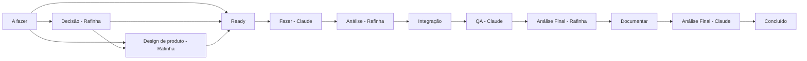

# skills-claude

Coleção pessoal de [skills](https://docs.claude.com/en/docs/claude-code/skills) do Claude Code que automatizam o fluxo de desenvolvimento de Rafinha: da criação da issue no Jira até o merge, QA, documentação e release — com Claude executando cada etapa do pipeline sozinho, sempre parando para decisão humana nos pontos que importam.

## O pipeline Rafinha-Claude

Cada coluna do Jira tem uma skill dona. Issues de código são implementadas de verdade (branch, commit, PR); issues de documentação são delegadas para quem escreve Confluence.

> **Pacotes 1, 2 e 3 em vigência em `master`.** Design, labels e gates
> (Pacote 1), o modelo de branches por épico com release controlada
> (Pacote 2) e as skills de documentação (Pacote 3) já valem. A
> configuração de CI e branch protection para `epic/**` e `release/current`
> nos repositórios de produto é manual, feita por Rafinha em sessão
> separada — confirme com ele antes de assumir que já rodou. O piloto do
> catálogo de componentes espera a sigla oficial do produto (ver
> `plano-pacote-3.md` §7). **Pacote 4 (revisão do workflow inteiro,
> `plano-pacote-4.md`) implementado nas skills e no Confluence** — 12
> colunas, escopo operacional explícito e as três skills novas de intake,
> decisão e captura de incidente. A configuração real do board do Jira
> (criar as colunas `Decisão - Rafinha` e `Ready`) continua manual, de
> Rafinha, fora desta sessão.

**`Decisão - Rafinha` e `Ready` entram como camadas oficiais.** `A fazer` é
entrada bruta — nunca fila para `Fazer - Claude` direto. A
`jira-sprint-intake-executor` amadurece o escopo informado e roteia para
`Decisão - Rafinha` (pendência real), `Design de produto - Rafinha`
(design confirmado) ou, excepcionalmente, `Ready`. A
`jira-issue-decision-resolver` fecha pendências **uma issue por vez, em
conversa** com Rafinha, e move para design ou `Ready`. `Fazer - Claude`
passa a receber só de `Ready`, e ganha um gate defensivo: se a descrição
ainda tiver **Pendências de decisão** abertas, a `jira-issue-executor` para
e reporta em vez de implementar decisão pendente.

**Nenhuma skill executora roda às cegas.** Toda execução operacional
(`jira-issue-executor`, `jira-integration-executor`, `jira-qa-executor`,
`jira-doc-executor`, `jira-human-validation-executor`,
`jira-review-executor`) exige escopo explícito de Rafinha antes de buscar
issues — Épico, lista de issues, ou coluna inteira **confirmada**. Estar na
coluna certa não autoriza issue fora do escopo.

**Documentar é trabalho composto.** São cinco writers, um por fonte da
verdade — produto, código, tela, usuário final e o próprio workflow. Numa
issue de código, a `jira-doc-executor` não escolhe **um** writer: monta o
conjunto dos que se aplicam, imprime o plano, e declara com motivo os que
pulou. Documentar uma tela atualiza a página do módulo, escreve a da tela e
entra no guia de usuário que passa por ela — cada writer escreve só o que a
sua fonte entrega, e linka em vez de repetir.

**Design de Produto entra como coluna.** `Design de produto - Rafinha` é
etapa **manual** — nenhuma skill a varre. A issue só passa por ela quando tem
a label `requires-design`, que é **confirmada manualmente por Rafinha**: a
skill pode sugerir, nunca aplicar. Se a issue tem a label e o Design Package
não está em `.claude/design-packages/<ISSUE-KEY>/`, a implementação **para
antes de escrever código** — nunca implementa no escuro, e nunca conclui que
o design não foi feito, apenas que o artefato não está naquela máquina.

**O tipo do ticket substituiu o campo `Tipo`.** A natureza da issue passa a
ser o tipo nativo do Jira — Implementação, Correção, Bug, Refatoração
Técnica, Documentação, Validação Humana, Epic. O campo customizado saiu do
contrato e nenhuma skill deve lê-lo. Correção e Bug são coisas diferentes:
ajuste visual de algo já entregue é **Correção** com `correcao-ui`.

**Labels têm matriz oficial.** O vocabulário vive no Confluence, em 11
categorias. Nenhuma skill pode inventar label fora dela; uma label
documentada pode ser criada no Jira sob demanda. A décima categoria —
produto/módulo/feature — é declarada **por produto**, na página de controle
daquele produto. A label genérica de revisão saiu do contrato: a revisão já
é representada por coluna.

A décima primeira categoria — **estado operacional de integração** —
registra onde o código da issue está no fluxo de branches: `integrado-epico`
e `qa-develop-aprovado`. Ela não contradiz a regra acima: cada uma dessas
duas labels carrega informação que **nenhuma coluna tem**.

**Gates não têm fallback silencioso.** Quando o contrato esperado não é
encontrado, a skill **para e reporta**. O caso que motivou a regra: o QA
assumia `web` quando faltava a label de plataforma — um QA no executor errado
produz um verde que não significa nada.

**`Documentar` fica depois da aceitação.** Rafinha valida primeiro se o
produto resolve o problema; só então a documentação registra o estado
**aceito**, e a auditoria final vê as duas coisas prontas.

**Branch de épico é opcional e explícita.** A branch da issue nem sempre nasce
da `develop`: se a issue pertence a um épico com branch ativa, ela nasce de
`epic/<EPIC-KEY>-<nome>`, e o Pull Request aponta para lá. Mas pertencer a um
épico **não** cria a branch — ela só nasce sob comando explícito de Rafinha, e
issue de épico sem branch integra direto na `develop`, normalmente.

**A Integração tem três modos, e nunca escolhe sozinha.** Modo A (issue →
branch do épico), Modo B (branch do épico → `develop`, promovendo o épico
inteiro) e Modo C (issue → `develop`). Rafinha informa o modo, ou a skill para
e pergunta — mesmo quando a estrutura das branches parece indicar o caminho
óbvio. Antes de qualquer merge, a skill imprime o resumo operacional do que
entendeu.

**Duas labels carregam o que a coluna não diz.** Existe **uma** coluna
`Integração` para três destinos de merge, então `integrado-epico` é o único
jeito de saber em qual branch o código parou. E o ciclo de release lê a issue
muito depois de ela ter saído de `QA - Claude`, então `qa-develop-aprovado` é o
único registro durável de que aquele QA passou. Nenhuma skill aplica e remove a
mesma label — as duas pontas ficam auditáveis na revisão final.

**A release não parte da `develop`.** Ela parte de `release/current`, a branch
persistente de estabilização, e chegar lá exige provar que **todo** commit do
intervalo rastreia para uma issue com `qa-develop-aprovado`. Commit direto na
`develop`, sem PR, bloqueia a promoção. Exceção só com autorização explícita de
Rafinha, registrada com risco, frase de autorização e impacto.

`workflow-development-flow` é a skill mãe: não executa nada, apenas responde "em qual etapa uma issue está", "o que vem depois de X", "qual gate se aplica" ou "essa label é oficial" para as demais. Release & Versionamento (SemVer, tags, GitHub Release) é um ciclo separado, acionado sob demanda — nunca uma coluna do board.

**Release é distribuição, não tag.** Uma release transforma um estado do software num pacote versionado que roda **fora do ambiente de desenvolvimento** — e não apenas numa tag com artefato anexado. Todo pedido tem dois eixos: **tipo** (`PRE_RELEASE` ou `FINAL`) e **escopo** (parcial ou completa).

**Projeto ≠ repositório.** Um projeto pode ser monorepo ou multi-repo, e a topologia é declarada em `.release/project.yml`, nunca inferida. A unidade versionada é o **componente** (tag `<componente>/vX.Y.Z`); uma distribuição completa recebe também uma versão de **produto**. Dependências entre componentes são declaradas, nunca descobertas: elas expandem o escopo pedido no escopo efetivo, e um componente puxado que não mudou entra como `carried` — sem versão nova.

**Três camadas, ninguém decidindo pelo vizinho.** A `release.yml` de cada repositório builda e publica seu componente. O **Release Orchestrator** local (PowerShell, um por projeto) dispara as Actions, coleta os artefatos, inclui o Runtime Package e gera o ZIP com o `release-manifest.yml` dentro. A `jira-release-executor` faz o que exige contexto: escopo vindo do Jira, incrementos sugeridos, notas em texto corrido, e o registro final. **Rafinha continua fechando um componente sozinho pela aba Actions**, sem skill e sem Orchestrator.

GitHub Release só em versão **final** — nenhum RC polui a aba Releases, e nenhum repositório vira dono do produto. A distribuição vai para o Drive e é registrada no Confluence.

**Validação Humana Agregada.** A unidade de implementação é a Issue, mas a unidade de aceitação humana pode agregar várias: antes da `Análise Final - Rafinha`, a `jira-human-validation-executor` varre a coluna, agrupa as issues por comportamento funcional e cria *Validações Humanas* contendo só os cenários que ainda exigem julgamento humano — nada do que o QA já automatizou volta como passo. Não é uma coluna nova nem um status novo, e não substitui QA, code review ou auditoria.

**Execution State.** O chat não é fonte de verdade: uma issue em execução pode ser retomada por uma sessão nova do Claude Code — troca de conta, esgotamento de quota, encerramento inesperado — sem depender do transcript anterior. `jira-issue-executor`, `jira-integration-executor`, `jira-qa-executor`, `jira-doc-executor` e `jira-review-executor` mantêm um arquivo `.claude/execution-state/<CHAVE>.md` com o ponto de retomada, reconciliado com Jira/Git/GitHub antes de qualquer ação — nunca uma instrução cega. Não é uma etapa nem uma coluna nova.

## Skills

### Pipeline Jira

| Skill | O que faz |
|---|---|
| [`workflow-development-flow`](workflow-development-flow/SKILL.md) | Referência do fluxo: lista canônica de 12 colunas, escopo operacional explícito, hierarquia Épico/Issue/Subtask, os 7 tipos oficiais de ticket, os 13 gates operacionais, a camada de Design de Produto, o vocabulário de labels, a descrição padronizada da issue, o modelo de branches e os três modos da Integração, ciclo de release e Execution State. |
| [`jira-issue-creator`](jira-issue-creator/SKILL.md) | Cria issues/subtasks no Jira com tipo oficial, descrição padronizada de 9 seções e labels da matriz — sugere `requires-design`, nunca aplica. Destino: `A fazer` ou backlog. |
| [`jira-sprint-intake-executor`](jira-sprint-intake-executor/SKILL.md) | Amadurece o escopo confirmado em `A fazer`: explicita lacunas, registra pendências, roteia para `Decisão - Rafinha`, `Design de produto - Rafinha` ou `Ready`. Nunca move direto para `Fazer - Claude`. |
| [`jira-issue-decision-resolver`](jira-issue-decision-resolver/SKILL.md) | Fecha pendências de decisão de uma issue por vez, em conversa com Rafinha — nunca varre a coluna em lote. |
| [`jira-issue-executor`](jira-issue-executor/SKILL.md) | Implementa, de forma passiva, as issues de "Fazer - Claude" vindas de `Ready`: gate de Pendência de decisão, gate de Design, código + testes + review automatizado + PR. |
| [`jira-integration-executor`](jira-integration-executor/SKILL.md) | Faz o merge real para `develop`, validando GitHub Actions e conflitos antes. |
| [`jira-qa-executor`](jira-qa-executor/SKILL.md) | QA funcional/visual — plataforma escolhe o executor, protocolo escolhe a estratégia. Sem label de plataforma, bloqueia. |
| [`jira-doc-executor`](jira-doc-executor/SKILL.md) | Roda depois da aceitação. Identifica a documentação impactada e delega para o writer certo; ignora `validacao-humana`. |
| [`jira-human-validation-executor`](jira-human-validation-executor/SKILL.md) | Agrupa as issues por comportamento e gera as Validações Humanas — só os cenários que exigem julgamento humano. Registra o veredito e roteia reprovações. |
| [`jira-review-executor`](jira-review-executor/SKILL.md) | Auditoria final antes de "Concluído" — inclui o contrato de labels, tipos e gates. |
| [`jira-release-executor`](jira-release-executor/SKILL.md) | Prepara e executa releases: resolve tipo e escopo, expande dependências declaradas, sugere os incrementos, escreve as notas e entrega a execução ao Release Orchestrator — até a distribuição validada fora da IDE. |

### Documentação (Confluence)

| Skill | O que faz |
|---|---|
| [`product-doc-writer`](product-doc-writer/SKILL.md) | Documentação de produto: regra de negócio, requisito, caso de uso, fluxo de produto, critérios de aceitação. |
| [`tech-doc-writer`](tech-doc-writer/SKILL.md) | Documentação técnica: módulo, API, arquitetura para devs, componente reutilizável. |
| [`screen-doc-writer`](screen-doc-writer/SKILL.md) | Documentação de tela/UI, com prints reais via navegação ao vivo — modos `dev`/`user`/`hybrid`. |
| [`user-doc-writer`](user-doc-writer/SKILL.md) | Guias de usuário final — a tarefa que atravessa telas, ponta a ponta. |
| [`workflow-doc-writer`](workflow-doc-writer/SKILL.md) | Documentação do próprio workflow: fichas de skill (com checagem de drift contra o `SKILL.md` real), páginas de pipeline, documentação de release de cada projeto (o Manifest copiado, nunca reescrito). |
| [`doc-pendency-resolver`](doc-pendency-resolver/SKILL.md) | Resolve pendências e ambiguidades perguntando antes de escrever, nunca assumindo. |

### Qualidade & produtividade

| Skill | O que faz |
|---|---|
| [`flutter-development-standards`](flutter-development-standards/SKILL.md) | Checklist de arquitetura/boas práticas Flutter, incluindo componentes reutilizáveis e IDs canônicos do Design System. |
| [`workflow-incident-capture-executor`](workflow-incident-capture-executor/SKILL.md) | Registra incongruências do workflow num `.md` local, sem corrigir nada nem tocar Jira/Confluence/GitHub/código — observação pura para retomada depois. |
| [`weekly-organizer`](weekly-organizer/SKILL.md) | Organiza a semana e o inbox do Todoist. |
| [`task-creator-trabalho`](task-creator-trabalho/SKILL.md) | Registra tarefas e contexto de trabalhos acadêmicos. |

## Como usar

São skills do Claude Code — cada pasta é uma skill com seu `SKILL.md`. Clone para `~/.claude/skills/` (globais) ou `.claude/skills/` de um projeto, e o Claude passa a reconhecê-las automaticamente pelo gatilho descrito em cada `description`.

A maior parte pressupõe o ecossistema real de Rafinha (Jira via Atlassian Rovo, Confluence, GitHub, AIO Tests, Maestro) — usar como referência de arquitetura de skills ou adaptar os nomes de projeto/board antes de reaproveitar em outro contexto.
